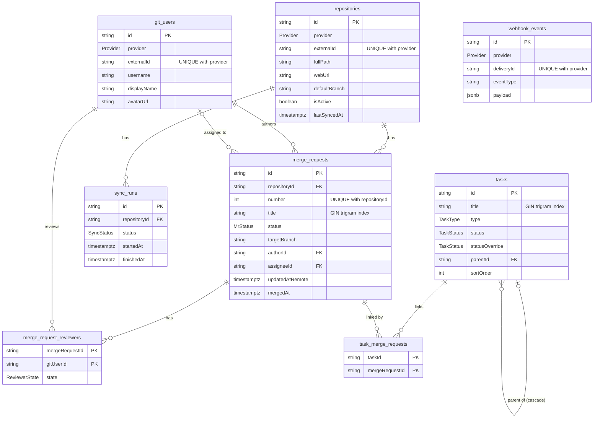

# Architecture

See `docs/SPEC.md` section 4 for the layering rules (routes → services → repositories).

## Database ER diagram

Every table also has `createdAt` and `updatedAt` (`timestamptz`, UTC).
