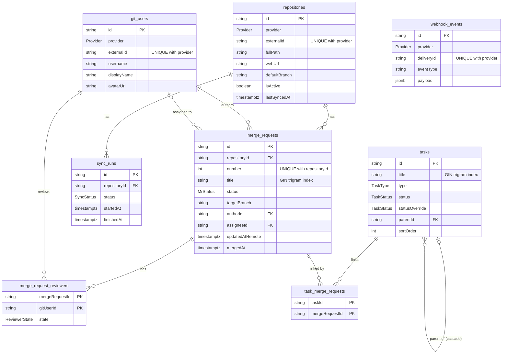

# Architecture

See `docs/SPEC.md` section 4 for the layering rules (routes → services → repositories).

## Database ER diagram

Every table also has `createdAt` and `updatedAt` (`timestamptz`, UTC).

## Core REST API (Phase 4)

Request flow: `routes` (Zod-parse params/query/body, Zod-parse the response) → `services`
(rules, mapping to shared DTOs) → `repositories` (Prisma only). Errors always use
`{ error: { code, message, details? } }`; services throw `AppError`, Zod failures become
`VALIDATION_ERROR` (400). Lists use opaque keyset cursors (`{ items, nextCursor }`):
merge requests order by `<sort column> <order>, id <order>`; tasks by `sortOrder, id`.

Cross-cutting plugins: helmet, CORS (`WEB_ORIGIN`), global rate limit (`RATE_LIMIT_MAX`/min,
5/min on login), ETag (weak, 304 on `If-None-Match`) registered before gzip/brotli
compression, and a stateless HMAC-signed session cookie (httpOnly, SameSite=Strict, Secure
outside development) enforced on `/api/*` when `DASHBOARD_PASSWORD` is set. `/api/health`,
`/api/auth/*`, `/api/webhooks/*` and `/api/gitlab-webhook` are exempt.

`/api/stats` is cached in memory for 10s; call `invalidateStatsCache()` from any code path that
changes merge requests. Services that change an MR should call
`recalculateTasksForMergeRequest(mrId, tx)` inside the same transaction.

### Query plans (large seed: 10,000 MRs, 2,000 tasks)

Reproduce with `pnpm db:seed:large && pnpm db:explain`; benchmark with `pnpm bench`
(p95 over 100 requests per scenario, in-process `inject`, budget < 100 ms).

| Query                            | Plan (after the Phase 4 index migration)                              | Time    |
| -------------------------------- | --------------------------------------------------------------------- | ------- |
| MR first page / keyset page      | Index scan `merge_requests_updatedAtRemote_id_idx`, no sort           | < 7 ms  |
| MR filter by status              | Index scan `updatedAtRemote_id_idx` with filter (status is common)    | < 1 ms  |
| MR filter by repository          | `merge_requests_repositoryId_updatedAtRemote_idx` + incremental sort  | 0.15 ms |
| MR filter by author / assignee   | Bitmap scan `authorId_idx` / `assigneeId_idx`, top-N sort             | 0.2 ms  |
| MR search (rare term)            | Bitmap scan on GIN `merge_requests_title_idx` (trigram)               | 0.17 ms |
| MR search (common term)          | Ordered index scan, stops after 51 matches                            | 0.4 ms  |
| MR merged today (stats)          | `mergedAt_idx` AND `status_idx` bitmap                                | 0.13 ms |
| Task top-level page              | Seq scan + top-N sort (2,000 rows; index not worthwhile at this size) | 0.5 ms  |
| Task children                    | `tasks_parentId_sortOrder_idx`                                        | 0.2 ms  |
| Task filter by status / assignee | `tasks_status_idx` / `tasks_assigneeName_idx` bitmap scans            | < 0.3ms |
| Task filter by type / search     | Seq scan (low selectivity / tiny table; planner prefers it)           | < 0.3ms |

`status IN (OPEN, IN_REVIEW)` is served by the ordered `updatedAtRemote_id` index because the
filter matches ~40% of rows; `merge_requests_status_updatedAtRemote_idx` is used for rarer
status sets. End-to-end p95 (including Prisma, mapping and Zod validation):
MR lists 8–18 ms, task lists 12–26 ms (200-row pages: 17 ms / 26 ms).
