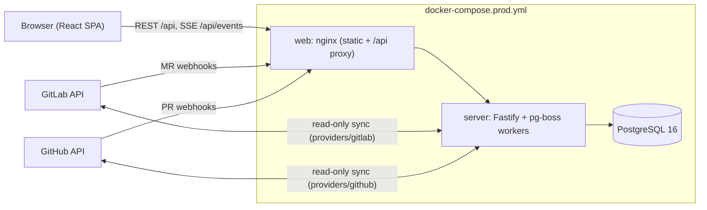
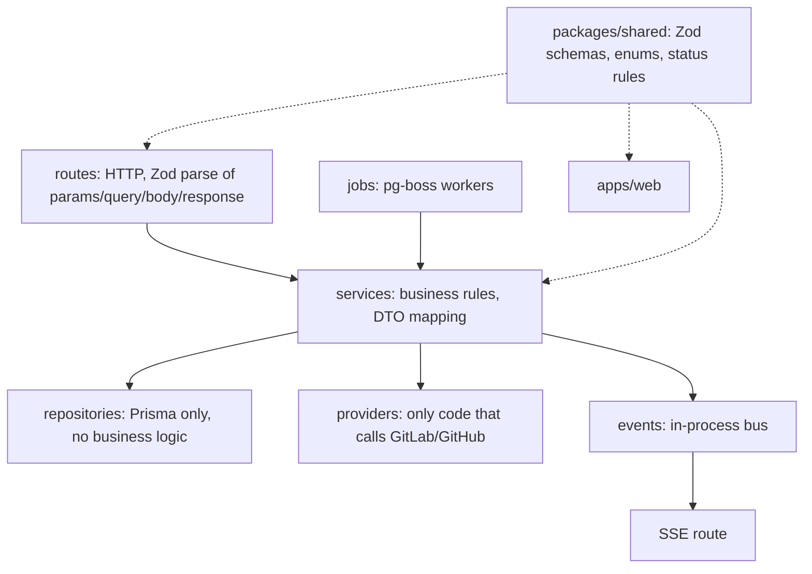
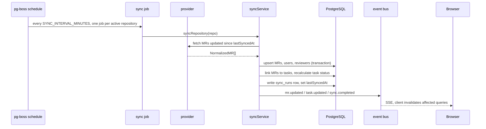
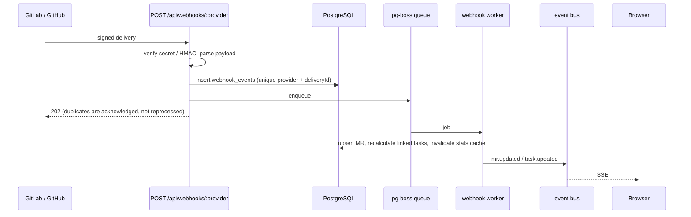
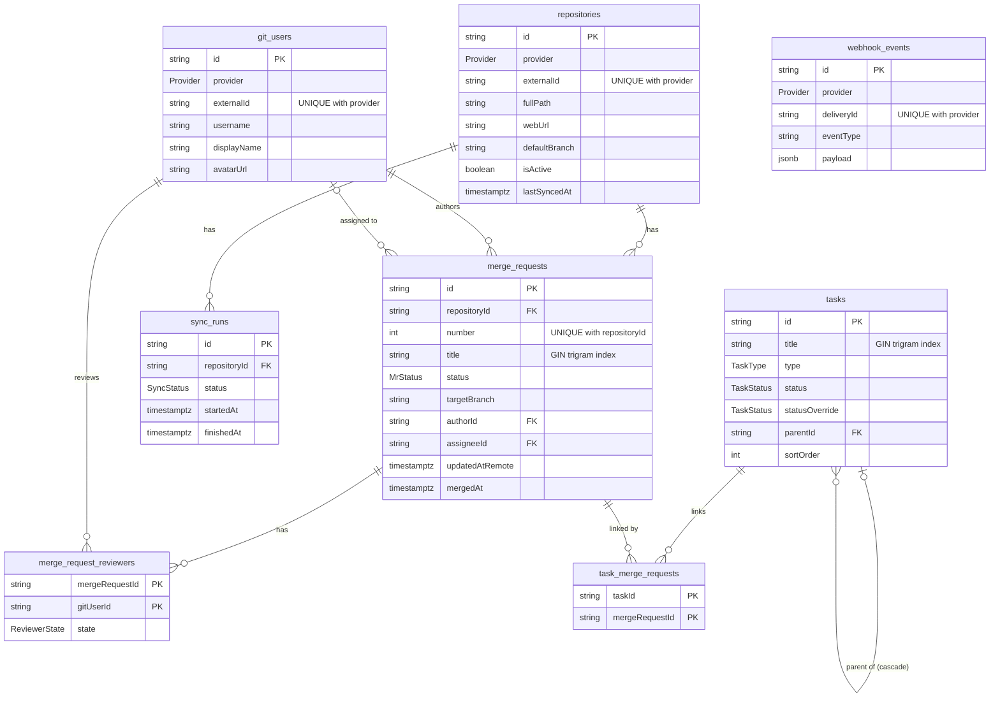

# Architecture

See `docs/SPEC.md` section 4 for the full layout. This document is the final reference for how
the pieces fit together, the database model, and the measured performance.

## System overview

In development Vite serves the SPA on :5173 and proxies `/api` to the server on :4000.
`pg-boss` stores its queues in the same PostgreSQL database, so there is no extra service.

## Layering rules

- Routes never import Prisma; repositories hold no business logic; external APIs are reached
  only through `providers/`.
- Schemas, enums and the status/aggregation functions live in `packages/shared` and are
  imported by both apps, never duplicated.
- Config comes only from `config/env.ts` (Zod, fails fast). Timestamps are UTC `timestamptz`;
  the UI formats them in `APP_TIMEZONE`.

## Data flow: periodic sync

## Data flow: webhooks

Details and setup per provider: [WEBHOOKS.md](WEBHOOKS.md).

## Containers

`docker/server.Dockerfile` has `build` (full workspace; reused as the one-shot `migrate`
job), `deploy` (`pnpm deploy --prod` plus the generated Prisma client) and `runtime`
(`node:20-slim`, user `node`, healthcheck on `/api/health`). `docker/web.Dockerfile` builds
the SPA and serves it from `nginx-unprivileged` on :8080 with `/api` proxied to `server:4000`
(buffering off for SSE) and a `/healthz` healthcheck. Startup order is enforced by compose:
postgres healthy → migrate completed → server healthy → web.

## Database ER diagram

Every table also has `createdAt` and `updatedAt` (`timestamptz`, UTC).

## Core REST API (Phase 4)

Request flow: `routes` (Zod-parse params/query/body, Zod-parse the response) → `services`
(rules, mapping to shared DTOs) → `repositories` (Prisma only). Errors always use
`{ error: { code, message, details? } }`; services throw `AppError`, Zod failures become
`VALIDATION_ERROR` (400). Lists use opaque keyset cursors (`{ items, nextCursor }`):
merge requests order by `<sort column> <order>, id <order>`; tasks by `sortOrder, id`.

Cross-cutting plugins: helmet, CORS (`WEB_ORIGIN`), global rate limit (`RATE_LIMIT_MAX`/min,
5/min on login), ETag (weak, 304 on `If-None-Match`) registered before gzip/brotli
compression, and the auth plugin enforced on `/api/*` when sign-in is enabled: a stateless
HMAC-signed password cookie (httpOnly, SameSite=Strict, Secure outside development) and/or a
server-side OAuth session (`sessions` table, SHA-256 token hash, 14-day sliding expiry,
SameSite=Lax). Mutations must come from `WEB_ORIGIN` (Origin/Referer check). `/api/health`,
`/api/auth/*`, `/api/webhooks/*` and `/api/gitlab-webhook` are exempt. See
[AUTH.md](AUTH.md) for the sign-in flow.

`/api/stats` is cached in memory for 10s; call `invalidateStatsCache()` from any code path that
changes merge requests. Services that change an MR should call
`recalculateTasksForMergeRequest(mrId, tx)` inside the same transaction.

### Query plans (large seed: 10,000 MRs, 2,000 tasks)

Reproduce with `pnpm db:seed:large && pnpm db:explain`; benchmark with `pnpm bench`
(p95 over 100 requests per scenario, in-process `inject`, budget < 100 ms).

| Query                            | Plan (after the Phase 4 index migration)                              | Time    |
| -------------------------------- | --------------------------------------------------------------------- | ------- |
| MR first page / keyset page      | Index scan `merge_requests_updatedAtRemote_id_idx`, no sort           | < 7 ms  |
| MR filter by status              | Index scan `updatedAtRemote_id_idx` with filter (status is common)    | < 1 ms  |
| MR filter by repository          | `merge_requests_repositoryId_updatedAtRemote_idx` + incremental sort  | 0.15 ms |
| MR filter by author / assignee   | Bitmap scan `authorId_idx` / `assigneeId_idx`, top-N sort             | 0.2 ms  |
| MR search (rare term)            | Bitmap scan on GIN `merge_requests_title_idx` (trigram)               | 0.17 ms |
| MR search (common term)          | Ordered index scan, stops after 51 matches                            | 0.4 ms  |
| MR merged today (stats)          | `mergedAt_idx` AND `status_idx` bitmap                                | 0.13 ms |
| Task top-level page              | Seq scan + top-N sort (2,000 rows; index not worthwhile at this size) | 0.5 ms  |
| Task children                    | `tasks_parentId_sortOrder_idx`                                        | 0.2 ms  |
| Task filter by status / assignee | `tasks_status_idx` / `tasks_assigneeName_idx` bitmap scans            | < 0.3ms |
| Task filter by type / search     | Seq scan (low selectivity / tiny table; planner prefers it)           | < 0.3ms |

`status IN (OPEN, IN_REVIEW)` is served by the ordered `updatedAtRemote_id` index because the
filter matches ~40% of rows; `merge_requests_status_updatedAtRemote_idx` is used for rarer
status sets. End-to-end p95 (including Prisma, mapping and Zod validation):
MR lists 8–18 ms, task lists 12–26 ms (200-row pages: 17 ms / 26 ms).

## Performance (Phase 10)

Measured on 2026-10-03 on a GitHub Actions runner (2 vCPU) with the large seed
(10,000 MRs, 2,000 tasks), production builds, and the commands shown.

### Targets and results

| Target                                           | Result                                    | Status            |
| ------------------------------------------------ | ----------------------------------------- | ----------------- |
| `GET /api/merge-requests` p95 < 100 ms           | 7.6–17.5 ms (all MR scenarios)            | Met               |
| `GET /api/tasks` p95 < 100 ms                    | 10.1–23.5 ms (all task scenarios)         | Met               |
| Initial JS < 200 KB gzip                         | `/` 198.6 KB, `/merge-requests` 188.8 KB  | Met (thin margin) |
| Lighthouse desktop Performance ≥ 90 (Tasks)      | 100 (FCP 0.5 s, LCP 0.8 s, TBT 0 ms)      | Met               |
| Lighthouse desktop Performance ≥ 90 (MRs)        | 99 (FCP 0.5 s, LCP 0.8 s, TBT 0 ms)       | Met               |
| Lighthouse desktop Accessibility ≥ 90            | 100 on both pages                         | Met               |
| axe (WCAG 2.0/2.1 A + AA) in E2E                 | 0 violations on login, Tasks, MRs         | Met               |
| Coverage ≥ 80% lines, `apps/server/src/services` | 95.6% lines (93.6% stmts, 90.5% branches) | Met               |
| Coverage ≥ 80% lines, `packages/shared`          | 98.8% lines (status rules 100%)           | Met               |

Reproduce:

- Backend: `pnpm db:seed:large && pnpm bench` (p95 over 100 in-process requests per scenario).
- Bundle: `ANALYZE=1 pnpm --filter @mrdash/web build` writes `apps/web/reports/bundle.html`
  (treemap with gzip sizes). `pnpm bundle:size` (with the API and `vite preview` running)
  gzips every script the browser loads on first paint of each page and fails at 200 KB.
- Lighthouse: with the API and `vite preview` running, `DASHBOARD_PASSWORD=... pnpm lighthouse`
  (desktop preset, Chromium from Playwright; fails below 90).
- Coverage: thresholds are enforced by `pnpm test` (server `services`, shared).
- E2E: `pnpm e2e` (builds, loads the large seed, starts API on :4000 and preview on :4173).

### What changed to hit the targets

- **Production React in every build.** The web `build` script now sets `NODE_ENV=production`.
  Vite honours an inherited `NODE_ENV`, and CI exports `NODE_ENV=test`, which shipped the
  development build of React DOM (initial JS 268 KB gzip, Lighthouse unmeasured). This was the
  largest single win (−70 KB).
- Task drawer and task form dialog are lazy-loaded on first use (−10 KB initial).
- `date-fns` replaced by the existing `relativeAge` helper (−3 KB); the dependency was removed.
- `--fg-muted` token lightened (`#6b7385` → `#8089a0`) to reach 4.5:1 contrast on all surfaces.
- Tasks table is an ARIA `treegrid` with `gridcell`s (`aria-level` is invalid on rows of a plain
  `table`); expand state lives on the toggle button's `aria-expanded`.

### Known limits / fix plan

- The initial-JS margin is 1.4 KB on the Tasks route. Biggest remaining items are React DOM
  (~97 KB gzip), React Router (~46 KB) and zod (~36 KB, shared schemas). If the budget is
  threatened: parse API responses with `zod/mini`, or split `AppShell`'s tooltip/popover
  (Radix + floating-ui, ~12 KB) behind a lazy boundary.
- Frame-rate for 10,000-row scroll was not re-measured in CI (no stable frame timing on shared
  runners); the tables render only visible rows plus overscan, and the E2E scroll test pages
  through the large seed.
